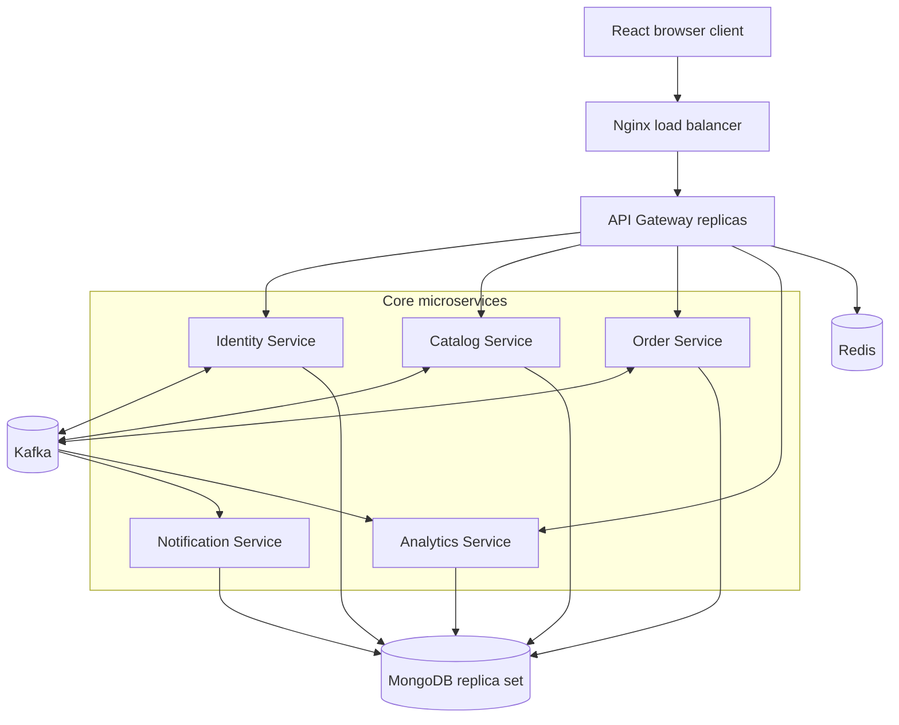
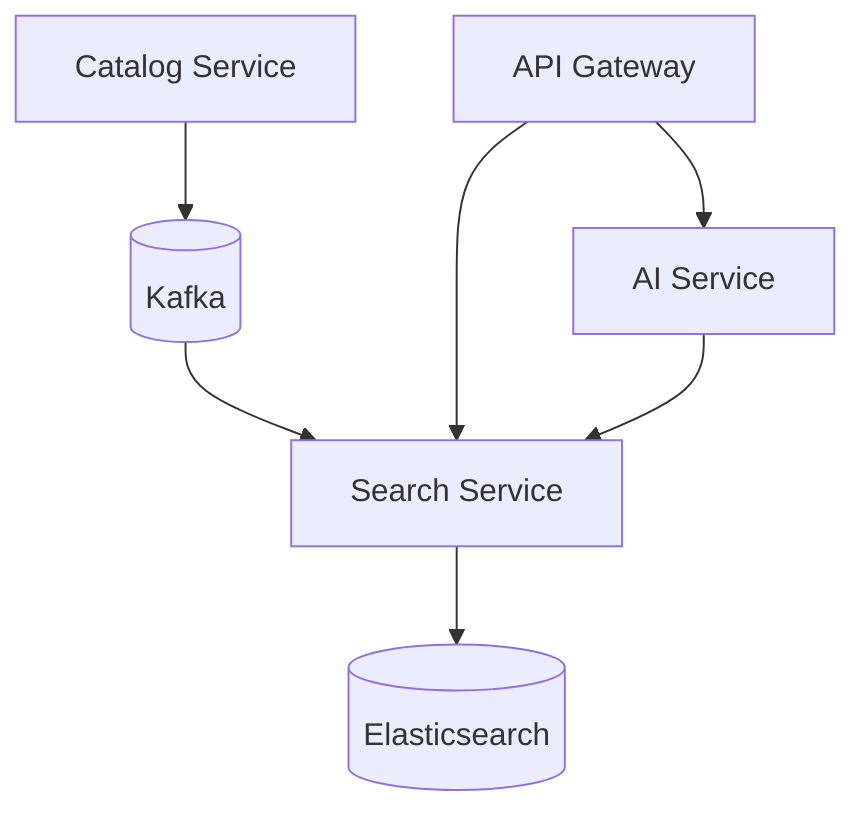
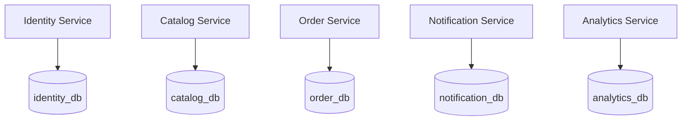
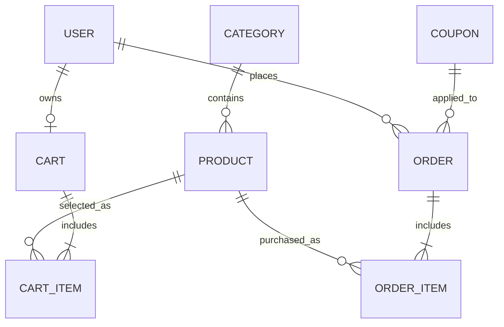
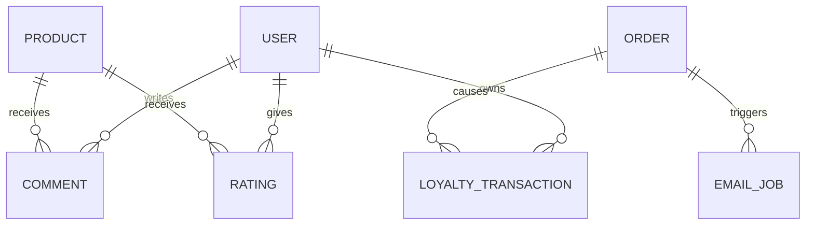
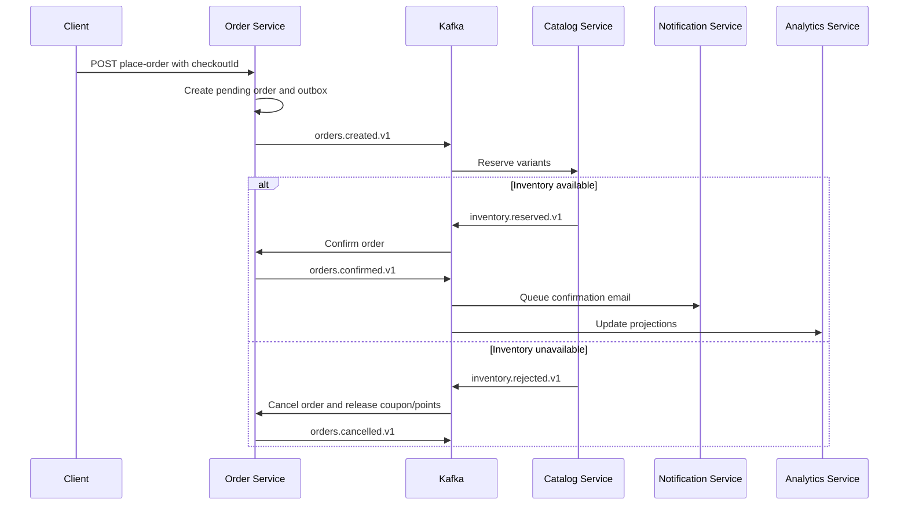
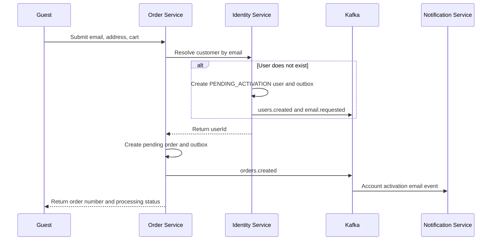

# NODEJS FINAL PROJECT - SOURCE ARCHITECTURE SPECIFICATION

> Tài liệu ngữ cảnh dành cho Codex trong VS Code  
> Phạm vi: chỉ mô tả cấu trúc mã nguồn trong thư mục `source/`, kiến trúc microservices + Kafka, MongoDB collections, API, luồng nghiệp vụ, bonus features, seed data, Docker và thứ tự triển khai.

---

## 1. Mục tiêu của dự án

Xây dựng website thương mại điện tử chuyên bán **máy tính và linh kiện/phụ kiện máy tính** bằng Node.js.

Hệ thống có hai loại người dùng:

- `CUSTOMER`: khách hàng.
- `ADMIN`: chỉ có một quản trị viên.

Website phải hỗ trợ:

- Khách chưa đăng nhập vẫn có thể duyệt sản phẩm, bình luận, sử dụng giỏ hàng và đặt hàng.
- Khi guest checkout, hệ thống tự tìm hoặc tạo tài khoản theo email và liên kết đơn hàng với tài khoản đó.
- Khách đã đăng nhập có thể quản lý hồ sơ, nhiều địa chỉ, mật khẩu, đơn hàng và điểm thưởng.
- Admin quản lý đúng các phần được đề bài cho phép: sản phẩm, danh mục, tồn kho, người dùng, đơn hàng, mã giảm giá và dashboard.
- Hệ thống có thể chạy nhiều Gateway/service replicas, dùng kiến trúc stateless và load balancing.

### 1.1. Ràng buộc bắt buộc

- Chỉ bán máy tính, linh kiện và phụ kiện máy tính.
- Không thêm loại sản phẩm không liên quan như điện thoại, quần áo hoặc mỹ phẩm.
- Không thêm chức năng Admin ngoài phạm vi đề bài.
- Mỗi sản phẩm có ít nhất hai biến thể.
- Mỗi sản phẩm có ít nhất ba hình ảnh.
- Mô tả chi tiết sản phẩm phải đủ dài, tối thiểu khoảng năm dòng khi hiển thị.
- Phân trang phải xuất hiện ở tất cả màn hình có danh sách sản phẩm.
- Số trang vẫn phải hiển thị khi chỉ có một trang.
- Không lưu session hoặc cart chỉ trong RAM của một service process.
- Không lưu mật khẩu dạng rõ, thông tin CVV hoặc số thẻ thanh toán đầy đủ.

---

## 2. Kiến trúc được lựa chọn

Sử dụng **event-driven microservices ngay từ đầu**. Kafka là hạ tầng giao tiếp bất đồng bộ chính giữa các service, không phải thành phần gắn thêm sau khi hoàn thành monolith.

Kiến trúc core gồm API Gateway và ít nhất năm business services. Như vậy đáp ứng rõ yêu cầu bonus có tối thiểu ba service ngoài frontend và database.

| Thành phần | Công nghệ đề xuất | Vai trò |
|---|---|---|
| Frontend | React + Vite + Material UI | Giao diện customer và admin |
| State/API | Redux Toolkit hoặc Zustand + Axios | Quản lý trạng thái và gọi Gateway |
| API Gateway | Node.js + Express.js | Một entry point, session, routing, rate limit |
| Identity Service | Node.js + Express + Mongoose | Auth, user, address, social login |
| Catalog Service | Node.js + Express + Mongoose | Category, product, inventory, comment, rating |
| Order Service | Node.js + Express + Mongoose | Cart, coupon, checkout, order, loyalty |
| Notification Service | Node.js + Kafka consumer | Email xác nhận/reset/activation |
| Analytics Service | Node.js + Kafka consumer | Dashboard projection và báo cáo |
| Message broker | Apache Kafka | Event bus và async decoupling |
| Database | MongoDB replica set | Mỗi service sở hữu database riêng |
| Session/cache | Redis | Session Gateway, cache, Socket.IO adapter |
| Realtime | Socket.IO | Comment/rating/order updates không reload |
| Search bonus | Elasticsearch + Search Service | Full-text product search |
| AI bonus | Node.js AI Service | Chatbot gợi ý sản phẩm |
| Image storage | Cloudinary | Lưu file ảnh, database chỉ lưu URL/publicId |
| Email | Nodemailer | Gửi email từ Notification Service |
| Social login | Google OAuth 2.0 | Đăng nhập mạng xã hội |
| Reverse proxy | Nginx | Load balancing Gateway replicas |
| Containers | Docker Compose | Chạy toàn bộ hệ thống bằng một lệnh |
| CI/CD bonus | GitHub Actions | Lint, test và build container |
| Testing | Jest + Supertest | Unit, integration, contract và event tests |

### 2.1. Ranh giới service

| Service | Sở hữu dữ liệu | API/event chính |
|---|---|---|
| `identity-service` | users, password tokens | auth, profile, addresses, user events |
| `catalog-service` | categories, products, comments, ratings | catalog, inventory reservation, product events |
| `order-service` | carts, coupons, orders, loyalty ledger | checkout, orders, coupons, order events |
| `notification-service` | email jobs | consume events và gửi email |
| `analytics-service` | dashboard projections | consume events và cung cấp dashboard |
| `search-service` | Elasticsearch index | consume product events và search; bonus |
| `ai-service` | conversation state tối thiểu | chatbot tư vấn dựa trên catalog; bonus |

Không service nào được đọc trực tiếp collection/database của service khác. Khi cần dữ liệu hiện thời, dùng HTTP nội bộ; khi cần đồng bộ trạng thái bất đồng bộ, dùng Kafka event.

### 2.2. Sơ đồ triển khai tổng quát



### 2.3. Bonus services



### 2.4. Nguyên tắc horizontal scaling

- Gateway và các HTTP service không lưu session trong bộ nhớ tiến trình.
- Session được lưu trong Redis.
- Có thể chạy nhiều replica cho Gateway và từng stateless service.
- Nginx phân phối request giữa các Gateway replicas.
- Kafka consumer group phân phối event giữa các replicas của cùng service.
- Socket.IO dùng Redis adapter để các instances chia sẻ sự kiện.
- Ảnh được lưu ngoài container trên Cloudinary.
- Tất cả cấu hình được truyền bằng environment variables.
- Mỗi Kafka consumer phải idempotent để event được xử lý an toàn khi giao lại.
- Không dùng distributed transaction giữa nhiều service; dùng Saga và compensating events.

---

## 3. Cấu trúc thư mục `source/`

Trong quá trình phát triển, thư mục `source/` được xem là Git repository root để `.github/workflows/ci.yml` hoạt động. Khi đóng gói bài nộp, giữ nguyên toàn bộ cây thư mục này bên trong thư mục `source` theo yêu cầu đề.

```text
source/
├── frontend/
│   ├── public/
│   ├── src/
│   │   ├── api/
│   │   ├── app/
│   │   ├── assets/
│   │   ├── components/
│   │   ├── features/
│   │   │   ├── auth/
│   │   │   ├── products/
│   │   │   ├── cart/
│   │   │   ├── checkout/
│   │   │   ├── orders/
│   │   │   ├── profile/
│   │   │   ├── reviews/
│   │   │   ├── chatbot/
│   │   │   └── admin/
│   │   ├── pages/
│   │   │   ├── customer/
│   │   │   ├── admin/
│   │   │   └── auth/
│   │   ├── routes/
│   │   ├── theme/
│   │   ├── utils/
│   │   ├── App.jsx
│   │   └── main.jsx
│   ├── Dockerfile
│   ├── package.json
│   └── vite.config.js
│
├── api-gateway/
│   ├── src/
│   │   ├── config/
│   │   ├── middlewares/
│   │   ├── proxy/
│   │   │   ├── identity.proxy.js
│   │   │   ├── catalog.proxy.js
│   │   │   ├── order.proxy.js
│   │   │   ├── analytics.proxy.js
│   │   │   ├── search.proxy.js
│   │   │   └── ai.proxy.js
│   │   ├── sockets/
│   │   ├── app.js
│   │   └── server.js
│   ├── tests/
│   ├── Dockerfile
│   └── package.json
│
├── services/
│   ├── identity-service/
│   │   ├── src/modules/auth/
│   │   ├── src/modules/users/
│   │   ├── src/modules/addresses/
│   │   ├── src/events/producers/
│   │   ├── src/events/consumers/
│   │   ├── src/outbox/
│   │   ├── seeds/
│   │   ├── tests/
│   │   ├── Dockerfile
│   │   └── package.json
│   ├── catalog-service/
│   │   ├── src/modules/categories/
│   │   ├── src/modules/products/
│   │   ├── src/modules/inventory/
│   │   ├── src/modules/comments/
│   │   ├── src/modules/ratings/
│   │   ├── src/modules/uploads/
│   │   ├── src/events/producers/
│   │   ├── src/events/consumers/
│   │   ├── src/outbox/
│   │   ├── seeds/
│   │   ├── tests/
│   │   ├── Dockerfile
│   │   └── package.json
│   ├── order-service/
│   │   ├── src/modules/carts/
│   │   ├── src/modules/coupons/
│   │   ├── src/modules/checkout/
│   │   ├── src/modules/orders/
│   │   ├── src/modules/loyalty/
│   │   ├── src/events/producers/
│   │   ├── src/events/consumers/
│   │   ├── src/outbox/
│   │   ├── seeds/
│   │   ├── tests/
│   │   ├── Dockerfile
│   │   └── package.json
│   ├── notification-service/
│   │   ├── src/modules/emails/
│   │   ├── src/events/consumers/
│   │   ├── src/templates/
│   │   ├── tests/
│   │   ├── Dockerfile
│   │   └── package.json
│   ├── analytics-service/
│   │   ├── src/modules/dashboard/
│   │   ├── src/events/consumers/
│   │   ├── src/projections/
│   │   ├── tests/
│   │   ├── Dockerfile
│   │   └── package.json
│   ├── search-service/                 # Bonus Elasticsearch
│   │   ├── src/modules/search/
│   │   ├── src/events/consumers/
│   │   ├── src/indexers/
│   │   ├── tests/
│   │   ├── Dockerfile
│   │   └── package.json
│   └── ai-service/                     # Bonus AI chatbot
│       ├── src/modules/chatbot/
│       ├── src/clients/search.client.js
│       ├── src/prompts/
│       ├── tests/
│       ├── Dockerfile
│       └── package.json
│
├── packages/
│   ├── event-contracts/
│   │   ├── schemas/
│   │   ├── topics.js
│   │   └── eventEnvelope.js
│   ├── kafka-client/
│   ├── logger/
│   ├── validation/
│   └── test-utils/
│
├── infra/
│   ├── nginx/nginx.conf
│   ├── kafka/
│   │   ├── create-topics.sh
│   │   └── topic-config.json
│   ├── mongodb/init-replica-set.js
│   ├── elasticsearch/
│   │   └── product-index-mapping.json
│   └── monitoring/
│       └── healthchecks.md
│
├── scripts/
│   ├── seed-all.js
│   ├── wait-for-services.sh
│   └── verify-compose.sh
├── tests/
│   ├── contract/
│   └── end-to-end/
├── .github/workflows/
│   └── ci.yml
├── .env.example
├── docker-compose.yml
├── package.json
└── README.txt
```

### 3.1. Cấu trúc chuẩn bên trong một service

Ví dụ `catalog-service`:

```text
catalog-service/src/
├── config/
├── middlewares/
├── modules/
│   └── products/
│       ├── product.model.js
│       ├── product.repository.js
│       ├── product.service.js
│       ├── product.controller.js
│       ├── product.validation.js
│       └── product.routes.js
├── events/
│   ├── producers/
│   ├── consumers/
│   └── handlers/
├── outbox/
│   ├── outbox.model.js
│   └── outbox.publisher.js
├── utils/
├── app.js
└── server.js
```

Trách nhiệm:

- `model`: Mongoose schema và indexes thuộc database của service.
- `repository`: truy vấn database nội bộ.
- `service`: nghiệp vụ và local transaction.
- `controller`: nhận HTTP request và trả response.
- `validation`: kiểm tra params, query và body.
- `routes`: định nghĩa endpoint và middleware.
- `events/producers`: phát domain events qua Kafka.
- `events/consumers`: đăng ký topic và consumer group.
- `events/handlers`: xử lý event theo cách idempotent.
- `outbox`: bảo đảm thay đổi database và event không bị lệch nhau.

Controller không chứa nghiệp vụ dài, không gọi Mongoose trực tiếp và không đọc database của service khác.

### 3.2. Monorepo workspace

Root `package.json` dùng npm workspaces để cài đặt và chạy các Node.js packages cùng repository:

```json
{
  "private": true,
  "workspaces": [
    "frontend",
    "api-gateway",
    "services/*",
    "packages/*"
  ]
}
```

---

## 4. MongoDB collection diagrams

MongoDB chạy dưới dạng replica set dùng chung hạ tầng, nhưng mỗi service sở hữu một logical database riêng. Việc tách database ownership là bắt buộc để microservices không trở thành distributed monolith.

### 4.1. Database ownership



| Database | Service sở hữu | Collections |
|---|---|---|
| `identity_db` | Identity Service | `users`, `password_tokens`, `outbox_events`, `processed_events` |
| `catalog_db` | Catalog Service | `categories`, `products`, `comments`, `ratings`, `inventory_reservations`, `outbox_events`, `processed_events` |
| `order_db` | Order Service | `carts`, `coupons`, `orders`, `loyalty_accounts`, `loyalty_transactions`, `outbox_events`, `processed_events` |
| `notification_db` | Notification Service | `email_jobs`, `processed_events` |
| `analytics_db` | Analytics Service | `dashboard_daily`, `dashboard_monthly`, `product_sales`, `processed_events` |

ObjectId nằm trong event hoặc document của service khác chỉ là logical reference. MongoDB không thực hiện populate/join xuyên database giữa các service.

### 4.2. Commerce core



`CART_ITEM` và `ORDER_ITEM` là embedded subdocuments, không phải collection riêng.

### 4.3. Feedback, loyalty và email



### 4.4. Danh sách collection

| Collection | Owner | Dữ liệu chính |
|---|---|---|
| `users` | Identity | Tài khoản, profile và địa chỉ |
| `categories` | Catalog | Danh mục máy tính/linh kiện |
| `products` | Catalog | Sản phẩm, embedded variants và tồn kho |
| `comments` | Catalog | Bình luận của user hoặc guest |
| `ratings` | Catalog | Số sao, unique theo user-product |
| `inventory_reservations` | Catalog | Giữ/trả tồn kho theo order Saga |
| `carts` | Order | Cart user hoặc guest, embedded items |
| `orders` | Order | Snapshot đơn hàng, payment và status history |
| `coupons` | Order | Mã giảm giá 5 ký tự và giới hạn dùng |
| `loyalty_accounts` | Order | Số dư điểm theo userId |
| `loyalty_transactions` | Order | Sổ cộng/trừ/hoàn điểm |
| `email_jobs` | Notification | Trạng thái email |
| `dashboard_*` | Analytics | Read models cho biểu đồ/dashboard |
| `outbox_events` | Mỗi producer service | Event chờ publish lên Kafka |
| `processed_events` | Mỗi consumer service | Event đã xử lý để chống xử lý trùng |

---

## 5. Chi tiết collections

Các đoạn dưới đây là cấu trúc dữ liệu định hướng. Khi triển khai phải chuyển thành Mongoose schemas, enums, validation và indexes tương ứng.

### 5.1. `users`

```javascript
{
  _id: ObjectId,
  email: "customer@example.com",
  passwordHash: "...",              // null khi guest account chưa kích hoạt
  fullName: "Nguyen Van A",
  phone: "0901234567",
  role: "CUSTOMER",                 // CUSTOMER | ADMIN
  isBanned: false,
  accountStatus: "ACTIVE",          // ACTIVE | PENDING_ACTIVATION
  socialAccounts: [
    {
      provider: "GOOGLE",
      providerUserId: "google-id"
    }
  ],
  addresses: [
    {
      _id: ObjectId,
      label: "Nha rieng",
      recipientName: "Nguyen Van A",
      phone: "0901234567",
      addressLine: "19 Nguyen Huu Tho",
      ward: "Tan Phong",
      district: "Quan 7",
      province: "TP. Ho Chi Minh",
      isDefault: true
    }
  ],
  createdAt: Date,
  updatedAt: Date
}
```

Quy tắc:

- Email được normalize về lowercase và unique.
- Chỉ seed script mới được tạo role `ADMIN`.
- Mỗi user chỉ có tối đa một địa chỉ `isDefault: true`.
- Khách bị ban không được đăng nhập, rating hoặc đặt đơn mới.
- `passwordHash` được tạo bằng bcrypt/argon2, tuyệt đối không lưu password gốc.

### 5.2. `categories`

```javascript
{
  _id: ObjectId,
  name: "Laptop",
  slug: "laptop",
  description: "May tinh xach tay",
  imageUrl: "https://...",
  isFeatured: true,
  isActive: true,
  createdAt: Date,
  updatedAt: Date
}
```

`isFeatured` dùng để chọn ít nhất ba danh mục hiển thị trên landing page.

### 5.3. `products`

```javascript
{
  _id: ObjectId,
  name: "ASUS TUF Gaming A15",
  slug: "asus-tuf-gaming-a15",
  brand: "ASUS",
  categoryId: ObjectId,
  tags: ["gaming", "laptop", "rtx-4060"],
  shortDescription: "Laptop gaming hieu nang cao",
  description: "Mo ta chi tiet du dai...",
  images: [
    {
      url: "https://res.cloudinary.com/...",
      publicId: "products/asus-a15-1",
      alt: "ASUS TUF Gaming A15 mat truoc"
    }
  ],
  variants: [
    {
      _id: ObjectId,
      sku: "ASUS-A15-R16-512",
      name: "Ryzen 7 / 16GB / 512GB",
      attributes: {
        cpu: "Ryzen 7",
        ram: "16GB",
        storage: "512GB SSD",
        color: "Black"
      },
      price: 25990000,
      costPrice: 22000000,
      stock: 15,
      reservedStock: 0,
      isActive: true
    }
  ],
  minPrice: 25990000,
  maxPrice: 29990000,
  averageRating: 4.5,
  ratingCount: 24,
  soldCount: 130,
  isActive: true,
  createdAt: Date,
  updatedAt: Date
}
```

Quy tắc:

- Có ít nhất ba phần tử trong `images`.
- Có ít nhất hai phần tử trong `variants`.
- `sku` unique trên toàn hệ thống.
- `price`, `costPrice` và `stock` không âm.
- Tồn khả dụng bằng `stock - reservedStock`.
- `minPrice` và `maxPrice` được tính lại khi variants thay đổi.
- `averageRating`, `ratingCount` và `soldCount` là cached fields để đọc nhanh.
- Không xóa cứng sản phẩm đã xuất hiện trong order; chuyển `isActive` thành false.

### 5.4. `carts`

```javascript
{
  _id: ObjectId,
  userId: ObjectId,                  // có khi đăng nhập
  guestToken: null,                  // có khi chưa đăng nhập
  items: [
    {
      productId: ObjectId,
      variantId: ObjectId,
      quantity: 2
    }
  ],
  couponCode: null,
  expiresAt: Date,
  createdAt: Date,
  updatedAt: Date
}
```

Quy tắc:

- Cart chỉ có `userId` hoặc `guestToken`, không có đồng thời cả hai.
- Không tin giá gửi từ frontend.
- Khi đọc hoặc checkout, backend lấy giá hiện hành từ product variant.
- Số lượng không được vượt tồn kho.
- Guest cart có TTL; user cart không tự hết hạn.
- Khi login, merge guest cart vào user cart rồi xóa guest cart.

### 5.5. `coupons`

```javascript
{
  _id: ObjectId,
  code: "A2B5C",
  discountType: "PERCENTAGE",       // PERCENTAGE | FIXED
  discountValue: 10,
  usageLimit: 10,
  usedCount: 3,
  isActive: true,
  createdBy: ObjectId,
  createdAt: Date,
  updatedAt: Date
}
```

Quy tắc:

- `code` được uppercase và match `^[A-Z0-9]{5}$`.
- `usageLimit` từ 1 đến 10.
- Không có ngày hết hạn.
- Coupon hợp lệ khi `isActive === true` và `usedCount < usageLimit`.
- Tăng `usedCount` bằng atomic update trong transaction đặt hàng.

### 5.6. `orders`

```javascript
{
  _id: ObjectId,
  orderNumber: "ORD-20260917-00001",
  userId: ObjectId,
  customer: {
    fullName: "Nguyen Van A",
    email: "customer@example.com",
    phone: "0901234567"
  },
  shippingAddress: {
    recipientName: "Nguyen Van A",
    phone: "0901234567",
    addressLine: "19 Nguyen Huu Tho",
    ward: "Tan Phong",
    district: "Quan 7",
    province: "TP. Ho Chi Minh"
  },
  items: [
    {
      productId: ObjectId,
      variantId: ObjectId,
      productName: "ASUS TUF Gaming A15",
      productImage: "https://...",
      brand: "ASUS",
      categoryName: "Laptop",
      sku: "ASUS-A15-R16-512",
      variantName: "Ryzen 7 / 16GB / 512GB",
      unitPrice: 25990000,
      unitCost: 22000000,
      quantity: 1,
      lineTotal: 25990000
    }
  ],
  pricing: {
    subtotal: 25990000,
    tax: 0,
    shippingFee: 30000,
    couponDiscount: 100000,
    pointsDiscount: 0,
    total: 25920000,
    totalCost: 22000000,
    profit: 3920000
  },
  coupon: {
    couponId: ObjectId,
    code: "A2B5C",
    discountType: "FIXED",
    discountValue: 100000,
    discountAmount: 100000
  },
  loyalty: {
    pointsUsed: 0,
    pointsEarned: 259
  },
  payment: {
    method: "COD",                  // COD | SIMULATED_ONLINE
    status: "PAID",                 // PENDING | PAID | FAILED
    transactionId: null,
    paidAt: Date
  },
  checkoutId: "uuid-from-client",
  workflowStatus: "AWAITING_INVENTORY",
  inventoryReservationId: null,
  loyaltyCredited: false,
  status: "CONFIRMED",
  statusHistory: [
    {
      status: "PENDING",
      updatedAt: Date,
      updatedBy: ObjectId
    }
  ],
  createdAt: Date,
  updatedAt: Date
}
```

Quy tắc:

- Order phải lưu snapshot tên, ảnh, giá bán, giá vốn, brand, category và variant.
- Thay đổi product sau này không làm thay đổi order cũ.
- Trạng thái hợp lệ: `PENDING`, `CONFIRMED`, `SHIPPING`, `DELIVERED`, `CANCELLED`.
- Mỗi lần đổi status phải push một phần tử vào `statusHistory`.
- `statusHistory` được trả về theo thời gian giảm dần.
- `orderNumber` unique và dễ đọc.
- `checkoutId` unique để request retry không tạo hai đơn.
- `workflowStatus` dùng nội bộ cho Saga; `status` là trạng thái hiển thị cho khách.
- Backend tự tính toàn bộ pricing; không nhận tổng tiền từ frontend.

### 5.7. `comments`

```javascript
{
  _id: ObjectId,
  productId: ObjectId,
  userId: ObjectId,                  // null đối với guest
  guestName: "Guest A",
  guestEmail: "guest@example.com",
  content: "San pham hoat dong tot.",
  createdAt: Date,
  updatedAt: Date
}
```

Quy tắc:

- Guest được comment mà không cần login.
- Nếu có `userId`, tên hiển thị lấy từ user.
- Validate độ dài và sanitize nội dung để chống XSS.
- Không tạo màn hình Admin moderation vì ngoài phạm vi Admin được phép.

### 5.8. `ratings`

```javascript
{
  _id: ObjectId,
  productId: ObjectId,
  userId: ObjectId,
  stars: 5,
  createdAt: Date,
  updatedAt: Date
}
```

Quy tắc:

- Bắt buộc login.
- Không bắt buộc đã mua sản phẩm.
- `stars` là số nguyên từ 1 đến 5.
- Unique compound index `{ productId, userId }`.
- Nếu rating đã tồn tại thì cập nhật, không tạo bản ghi thứ hai.
- Sau khi thay đổi, tính lại `averageRating` và `ratingCount` của product.

### 5.9. `loyalty_accounts`

```javascript
{
  _id: ObjectId,
  userId: ObjectId,
  pointsBalance: 300,
  version: 4,
  createdAt: Date,
  updatedAt: Date
}
```

Order Service sở hữu số dư điểm. Identity Service không lưu bản sao số dư trong `users`; frontend lấy điểm qua Order Service để tránh hai nguồn dữ liệu khác nhau.

### 5.10. `loyalty_transactions`

```javascript
{
  _id: ObjectId,
  userId: ObjectId,
  orderId: ObjectId,
  type: "EARN",                     // EARN | REDEEM | REFUND
  status: "COMMITTED",              // PENDING | COMMITTED | REVERSED
  points: 100,
  balanceAfter: 300,
  description: "Earned from order ORD-20260917-00001",
  createdAt: Date
}
```

Quy ước theo ví dụ đề bài:

- 1 point tương đương 1.000 VND.
- Giá trị thưởng bằng 10% giá trị đơn.
- `pointsEarned = floor(orderTotal * 0.1 / 1000)`.
- Cập nhật `loyalty_accounts.pointsBalance` và tạo ledger record trong cùng local transaction của Order Service.

### 5.11. `inventory_reservations`

```javascript
{
  _id: ObjectId,
  reservationId: "uuid",
  orderId: ObjectId,
  orderNumber: "ORD-20260917-00001",
  items: [
    {
      productId: ObjectId,
      variantId: ObjectId,
      quantity: 1
    }
  ],
  status: "RESERVED",              // RESERVED | RELEASED | COMMITTED | REJECTED
  reason: null,
  createdAt: Date,
  updatedAt: Date
}
```

Catalog Service dùng collection này để xử lý `order.created` idempotently. Cùng một order không được reserve stock hai lần.

### 5.12. `email_jobs`

```javascript
{
  _id: ObjectId,
  type: "ORDER_CONFIRMATION",       // ORDER_CONFIRMATION | PASSWORD_RESET | ACCOUNT_ACTIVATION
  orderId: ObjectId,
  userId: ObjectId,
  recipientEmail: "customer@example.com",
  status: "PENDING",                // PENDING | PROCESSING | SENT | FAILED
  attempts: 0,
  errorMessage: null,
  sentAt: null,
  createdAt: Date,
  updatedAt: Date
}
```

Worker gửi email tách khỏi request đặt hàng để tránh làm checkout chậm.

### 5.13. `outbox_events` và `processed_events`

```javascript
// outbox_events
{
  _id: ObjectId,
  eventId: "uuid",
  topic: "orders.created.v1",
  key: "order-id",
  payload: {},
  status: "PENDING",               // PENDING | PUBLISHED | FAILED
  attempts: 0,
  nextAttemptAt: Date,
  publishedAt: null,
  createdAt: Date
}

// processed_events
{
  _id: ObjectId,
  eventId: "uuid",
  consumer: "catalog-inventory-consumer",
  processedAt: Date
}
```

Quy tắc:

- Business document và outbox event được ghi trong cùng local MongoDB transaction.
- Publisher đọc pending outbox records rồi gửi Kafka.
- Consumer kiểm tra unique `eventId + consumer` trước khi tạo side effect.
- Chỉ commit Kafka offset sau khi local transaction thành công.
- Event lỗi nhiều lần được chuyển sang retry topic hoặc DLQ.

### 5.14. Analytics projections

Analytics Service không query trực tiếp database của Order/Catalog/Identity Service. Nó consume Kafka events và tự tạo read models:

```javascript
// dashboard_daily
{
  _id: ObjectId,
  date: "2026-09-17",
  newUsers: 5,
  orderCount: 14,
  revenue: 150000000,
  profit: 22000000,
  productsSold: 18,
  categoryBreakdown: [
    { categoryName: "Laptop", quantity: 6, revenue: 90000000 }
  ],
  updatedAt: Date
}
```

---

## 6. MongoDB indexes bắt buộc

```javascript
// users
{ email: 1 } unique

// categories
{ slug: 1 } unique

// products
{ slug: 1 } unique
{ "variants.sku": 1 } unique
{ categoryId: 1, isActive: 1 }
{ brand: 1, isActive: 1 }
{ minPrice: 1 }
{ averageRating: -1 }
{ soldCount: -1 }
{ createdAt: -1 }
text index: { name, brand, tags, shortDescription }

// carts
partial unique index on userId when userId exists
partial unique index on guestToken when guestToken exists
TTL index on expiresAt for guest carts

// coupons
{ code: 1 } unique

// orders
{ orderNumber: 1 } unique
{ checkoutId: 1 } unique
{ userId: 1, createdAt: -1 }
{ status: 1, createdAt: -1 }
{ workflowStatus: 1, updatedAt: 1 }
{ createdAt: -1 }
{ "coupon.couponId": 1 }

// comments
{ productId: 1, createdAt: -1 }

// ratings
{ productId: 1, userId: 1 } unique

// loyalty_transactions
{ userId: 1, createdAt: -1 }
{ orderId: 1 }

// loyalty_accounts
{ userId: 1 } unique

// inventory_reservations
{ reservationId: 1 } unique
{ orderId: 1 } unique

// email_jobs
{ status: 1, createdAt: 1 }

// outbox_events
{ eventId: 1 } unique
{ status: 1, nextAttemptAt: 1 }

// processed_events
{ eventId: 1, consumer: 1 } unique

// dashboard_daily
{ date: 1 } unique
```

---

## 7. Kafka event architecture

Kafka là thành phần core từ Phase 1. HTTP được dùng cho truy vấn cần phản hồi ngay; Kafka được dùng cho thay đổi trạng thái xuyên service, workflow bất đồng bộ, notification, analytics và search indexing.

### 7.1. Event envelope chuẩn

Mọi event phải dùng cùng envelope từ package `event-contracts`:

```javascript
{
  eventId: "uuid",
  eventType: "order.created",
  eventVersion: 1,
  occurredAt: "2026-09-17T10:30:00.000Z",
  producer: "order-service",
  correlationId: "checkout-or-request-id",
  causationId: "previous-event-id-or-null",
  key: "order-id",
  payload: {}
}
```

Quy tắc:

- `eventId` unique toàn hệ thống.
- `eventVersion` tăng khi payload có breaking change.
- `correlationId` theo toàn bộ checkout Saga để debug.
- Kafka message key là aggregate ID để giữ đúng thứ tự trong cùng partition.
- Không đưa password, session ID, access token hoặc thông tin thanh toán nhạy cảm vào event.

### 7.2. Topics chính

| Topic | Producer | Consumer chính | Partition key |
|---|---|---|---|
| `users.created.v1` | Identity | Notification, Analytics | `userId` |
| `users.updated.v1` | Identity | Analytics | `userId` |
| `products.created.v1` | Catalog | Search, Analytics | `productId` |
| `products.updated.v1` | Catalog | Search, Analytics | `productId` |
| `comments.created.v1` | Catalog | Realtime Gateway, Analytics | `productId` |
| `ratings.updated.v1` | Catalog | Search, Analytics | `productId` |
| `orders.created.v1` | Order | Catalog inventory | `orderId` |
| `inventory.reserved.v1` | Catalog | Order | `orderId` |
| `inventory.rejected.v1` | Catalog | Order | `orderId` |
| `inventory.release-requested.v1` | Order | Catalog | `orderId` |
| `orders.confirmed.v1` | Order | Notification, Analytics | `orderId` |
| `orders.cancelled.v1` | Order | Catalog, Notification, Analytics | `orderId` |
| `orders.status-changed.v1` | Order | Notification, Analytics | `orderId` |
| `loyalty.changed.v1` | Order | Analytics | `userId` |
| `email.requested.v1` | Identity/Order | Notification | `recipientEmail` |

Mỗi topic có retry topic và DLQ tương ứng khi cần, ví dụ:

```text
orders.created.v1
orders.created.v1.retry
orders.created.v1.dlq
```

### 7.3. Consumer groups

| Consumer group | Service | Nhiệm vụ |
|---|---|---|
| `catalog-inventory-group` | Catalog | Reserve/release inventory |
| `order-workflow-group` | Order | Tiếp tục hoặc rollback Saga |
| `notification-email-group` | Notification | Tạo và gửi email jobs |
| `analytics-projection-group` | Analytics | Cập nhật dashboard read models |
| `search-indexer-group` | Search | Đồng bộ Elasticsearch index |
| `realtime-gateway-group` | API Gateway | Đẩy comment/rating/order events qua Socket.IO |

Các replica trong cùng consumer group chia partition cho nhau. Hai service khác mục đích phải dùng group khác để đều nhận được event.

### 7.4. Checkout Saga



### 7.5. Outbox, retry và idempotency

- Producer không publish event trực tiếp bên trong controller.
- Local transaction ghi business data và `outbox_events` cùng lúc.
- Background publisher gửi outbox record lên Kafka và đánh dấu `PUBLISHED`.
- Consumer ghi `processed_events` trong cùng transaction với side effect.
- Consumer phải chịu được at-least-once delivery.
- Retry dùng exponential backoff và giới hạn số lần.
- Event không thể xử lý sau giới hạn retry được chuyển DLQ để demo và điều tra.
- Không tự động retry validation/business rejection như hết hàng.
- Có health endpoint hoặc metrics cho pending outbox, consumer lag và DLQ count.

### 7.6. Contract testing

- JSON Schema của event được version-control trong `packages/event-contracts/schemas`.
- Producer test payload đúng schema trước khi publish.
- Consumer contract test bằng fixture event.
- Không xóa/đổi nghĩa field đang được consumer sử dụng; tạo version topic/schema mới nếu breaking change.

---

## 8. API design

Base path:

```text
/api/v1
```

Frontend chỉ gọi API Gateway. Các business service không expose port công khai ra host trong production/demo Compose, ngoại trừ healthcheck nội bộ.

| Public path prefix | Gateway chuyển tới |
|---|---|
| `/api/v1/auth`, `/api/v1/users` | Identity Service |
| `/api/v1/categories`, `/api/v1/products` | Catalog Service |
| `/api/v1/cart`, `/api/v1/coupons`, `/api/v1/checkout`, `/api/v1/orders` | Order Service |
| `/api/v1/admin/dashboard` | Analytics Service |
| `/api/v1/search` | Search Service |
| `/api/v1/ai` | AI Service |

Gateway xác thực session, tạo `x-request-id`, chuyển user context đã ký hoặc token nội bộ cho service. Business service vẫn kiểm tra authorization và không tin header do client tự gửi.

Response thành công thống nhất:

```javascript
{
  success: true,
  data: {},
  meta: {
    page: 1,
    limit: 12,
    totalItems: 40,
    totalPages: 4
  }
}
```

Response lỗi thống nhất:

```javascript
{
  success: false,
  error: {
    code: "VALIDATION_ERROR",
    message: "Invalid request data",
    details: []
  }
}
```

### 8.1. Authentication và profile

| Method | Endpoint | Authentication | Mục đích |
|---|---|---|---|
| POST | `/auth/register` | Public | Đăng ký customer |
| POST | `/auth/login` | Public | Đăng nhập |
| GET | `/auth/google` | Public | Bắt đầu Google OAuth |
| GET | `/auth/google/callback` | Public | OAuth callback |
| POST | `/auth/forgot-password` | Public | Gửi email reset |
| POST | `/auth/reset-password` | Public/token | Đặt mật khẩu mới |
| POST | `/auth/logout` | User | Hủy session |
| GET | `/users/me` | User | Xem profile |
| PATCH | `/users/me` | User | Cập nhật profile |
| PATCH | `/users/me/password` | User | Đổi mật khẩu |
| GET | `/users/me/addresses` | User | Danh sách địa chỉ |
| POST | `/users/me/addresses` | User | Thêm địa chỉ |
| PATCH | `/users/me/addresses/:id` | User | Sửa địa chỉ |
| DELETE | `/users/me/addresses/:id` | User | Xóa địa chỉ |
| PATCH | `/users/me/addresses/:id/default` | User | Đặt mặc định |

### 8.2. Products, categories, comments và ratings

| Method | Endpoint | Authentication | Mục đích |
|---|---|---|---|
| GET | `/categories` | Public | Danh sách category |
| GET | `/products` | Public | Search/filter/sort/paginate |
| GET | `/products/:slug` | Public | Chi tiết sản phẩm |
| GET | `/products/:id/comments` | Public | Danh sách comment |
| POST | `/products/:id/comments` | Public | User hoặc guest comment |
| GET | `/products/:id/ratings` | Public | Tổng hợp rating |
| PUT | `/products/:id/rating` | User | Tạo hoặc cập nhật rating |

Query mẫu:

```text
GET /api/v1/products
  ?page=1
  &limit=12
  &search=gaming
  &category=laptop
  &brand=ASUS
  &minPrice=15000000
  &maxPrice=30000000
  &minRating=4
  &sort=price_asc
```

Các giá trị sort tối thiểu:

- `name_asc`
- `name_desc`
- `price_asc`
- `price_desc`

Có thể thêm `newest` và `best_selling` cho landing page.

### 8.3. Cart, coupon và checkout

| Method | Endpoint | Authentication | Mục đích |
|---|---|---|---|
| GET | `/cart` | User/guest token | Xem cart |
| POST | `/cart/items` | User/guest token | Thêm variant |
| PATCH | `/cart/items/:variantId` | User/guest token | Đổi quantity |
| DELETE | `/cart/items/:variantId` | User/guest token | Xóa item |
| DELETE | `/cart` | User/guest token | Xóa toàn bộ cart |
| POST | `/coupons/validate` | Public | Xem hiệu lực/giảm bao nhiêu |
| POST | `/checkout/preview` | User/guest | Backend tính lại tổng tiền |
| POST | `/checkout/place-order` | User/guest | Tạo order |

### 8.4. Customer orders

| Method | Endpoint | Authentication | Mục đích |
|---|---|---|---|
| GET | `/orders/me` | User | Lịch sử đơn hàng |
| GET | `/orders/me/:orderNumber` | User | Chi tiết và status history |

Customer chỉ được đọc order thuộc chính mình.

### 8.5. Admin endpoints

Tất cả endpoint dưới đây yêu cầu session hợp lệ và `role === ADMIN`.

| Method | Endpoint | Mục đích |
|---|---|---|
| GET | `/admin/dashboard/summary` | Tổng user, user mới, order, revenue, best sellers |
| GET | `/admin/dashboard/analytics` | Revenue, profit, order/product statistics theo thời gian |
| GET | `/admin/products` | Danh sách quản trị sản phẩm |
| POST | `/admin/products` | Thêm sản phẩm |
| PATCH | `/admin/products/:id` | Sửa sản phẩm/variant/tồn kho |
| DELETE | `/admin/products/:id` | Soft delete sản phẩm |
| GET | `/admin/categories` | Danh sách category |
| POST | `/admin/categories` | Thêm category |
| PATCH | `/admin/categories/:id` | Sửa category |
| DELETE | `/admin/categories/:id` | Deactivate category hợp lệ |
| GET | `/admin/users` | Danh sách user |
| PATCH | `/admin/users/:id` | Sửa thông tin user |
| PATCH | `/admin/users/:id/ban` | Ban/unban user |
| GET | `/admin/orders` | Danh sách order, newest first, 20/page |
| GET | `/admin/orders/:id` | Chi tiết order |
| PATCH | `/admin/orders/:id/status` | Đổi trạng thái order |
| GET | `/admin/coupons` | Danh sách coupon và usage |
| POST | `/admin/coupons` | Tạo coupon |

Không tạo thêm các chức năng Admin khác nếu chưa có yêu cầu trực tiếp từ đề bài.

### 8.6. Bonus APIs

| Method | Endpoint | Service | Mục đích |
|---|---|---|---|
| GET | `/search/products` | Search | Elasticsearch full-text/filter/sort/paginate |
| POST | `/ai/chat` | AI | Chatbot hỏi đáp và gợi ý sản phẩm |

AI Service chỉ được đề xuất các sản phẩm lấy từ Search/Catalog Service, không tự bịa giá, tồn kho hoặc URL sản phẩm.

---

## 9. Luồng nghiệp vụ quan trọng

### 9.1. Guest checkout và tự tạo tài khoản



Không bắt guest đăng nhập trước khi checkout. Không gửi password rõ qua email.

### 9.2. Checkout Saga và local transactions

Không có một MongoDB transaction bao trùm nhiều service. Checkout dùng Saga gồm các local transactions:

**Bước A - Chuẩn bị đồng bộ**

1. Order Service load cart.
2. Gọi Identity Service để resolve/create guest user theo email.
3. Gọi Catalog Service internal quote endpoint để lấy snapshot giá và kiểm tra product/variant active.
4. Backend tự tính subtotal, tax, shipping, coupon, điểm và total.

**Bước B - Local transaction tại Order Service**

1. Kiểm tra `checkoutId` để chống double submit.
2. Reserve coupon usage và điểm trong `order_db`.
3. Tạo order với `workflowStatus = AWAITING_INVENTORY`.
4. Tạo `loyalty_transactions` loại `REDEEM`, trạng thái `PENDING` nếu dùng điểm.
5. Ghi `orders.created.v1` vào outbox.
6. Commit local transaction.

**Bước C - Local transaction tại Catalog Service**

1. Consume `orders.created.v1`.
2. Kiểm tra `processed_events` và `inventory_reservations`.
3. Atomic reserve stock cho tất cả variants.
4. Nếu đủ hàng, ghi reservation và outbox `inventory.reserved.v1`.
5. Nếu thiếu hàng, không thay đổi stock và ghi outbox `inventory.rejected.v1`.

**Bước D - Hoàn tất hoặc bù trừ tại Order Service**

- Khi nhận `inventory.reserved.v1`: xác nhận coupon/điểm, xác nhận order, xóa cart và phát `orders.confirmed.v1`.
- Khi nhận `inventory.rejected.v1`: release coupon/điểm, cancel order và phát `orders.cancelled.v1`.
- Khi payment thất bại sau khi reserve: phát `inventory.release-requested.v1` để Catalog Service trả stock.

Notification Service chỉ gửi email xác nhận khi nhận `orders.confirmed.v1`.

### 9.3. Hoàn thành đơn và cộng điểm

Khuyến nghị chỉ cộng điểm khi order chuyển sang `DELIVERED`, tránh việc khách nhận điểm từ đơn bị hủy.

1. Admin chuyển status sang `DELIVERED`.
2. Push status history.
3. Nếu order chưa nhận điểm, tính `pointsEarned`.
4. Cộng vào `loyalty_accounts.pointsBalance`.
5. Tạo `loyalty_transactions` loại `EARN` trong cùng local transaction.
6. Đánh dấu order đã credit điểm để tránh cộng hai lần.
7. Ghi `loyalty.changed.v1` và `orders.status-changed.v1` vào outbox.

### 9.4. Comment/rating realtime

1. Client mở product detail và join room `product:<productId>`.
2. Catalog Service validate và lưu comment/rating vào `catalog_db`.
3. Catalog Service ghi `comments.created.v1` hoặc `ratings.updated.v1` vào outbox.
4. Realtime Gateway consumer nhận event và emit vào product room.
5. Tất cả client đang xem sản phẩm cập nhật UI mà không reload.
6. Socket.IO Redis adapter truyền sự kiện giữa các Gateway replicas.

### 9.5. Cập nhật trạng thái order

- Không cho chuyển trạng thái tùy tiện ngược luồng.
- Luồng chuẩn: `PENDING -> CONFIRMED -> SHIPPING -> DELIVERED`.
- `PENDING` hoặc `CONFIRMED` có thể chuyển sang `CANCELLED` nếu chính sách cho phép.
- Mỗi cập nhật phải lưu `updatedAt` và `updatedBy`.
- Order Service phát `orders.status-changed.v1`; Notification và Analytics Service cập nhật bất đồng bộ.

---

## 10. Landing page và product catalog

Landing page cần các block:

- New Products: query `createdAt` giảm dần.
- Best Sellers: query `soldCount` giảm dần.
- Ít nhất ba category section được đánh dấu `isFeatured`.

Product catalog là trang riêng và phải có:

- Search theo từ khóa.
- Category filter.
- Brand filter bắt buộc.
- Min/max price filter bắt buộc.
- Rating filter để đủ ít nhất ba tiêu chí.
- Bốn cách sort bắt buộc.
- Pagination thực sự ở backend.
- UI luôn hiển thị số trang, kể cả `totalPages === 1`.

Giá hiển thị bằng định dạng VND, ví dụ:

```text
25.990.000 ₫
```

Không hiển thị trực tiếp `25990000`.

---

## 11. Dashboard projections

Analytics Service không query trực tiếp database của service khác. Nó consume `users.*`, `orders.*`, `products.*` và `ratings.*` events để cập nhật các projection collections trong `analytics_db`.

### 11.1. Simple dashboard

- Total users và new users từ `users.created.v1`.
- Total orders, revenue và profit từ confirmed/delivered order events.
- Best sellers từ item snapshots trong order events.
- Không tính cancelled orders vào revenue/profit.

### 11.2. Advanced dashboard

API nhận:

```text
period=year|quarter|month|week|custom
startDate=YYYY-MM-DD
endDate=YYYY-MM-DD
```

Trả về:

- Số order.
- Revenue.
- Profit.
- Số lượng sản phẩm bán.
- Phân bố category/product type.
- Các series so sánh theo time bucket.

Projection handler phải idempotent để event retry không cộng doanh thu hai lần. Cần có script `rebuild-projections` có thể xóa read models và replay seed/event fixtures khi demo hoặc kiểm thử.

---

## 12. Seed data

Không phụ thuộc API sản phẩm bên ngoài lúc chạy demo. Dữ liệu được lưu trong JSON và import vào MongoDB bằng seed script.

### 12.1. Dữ liệu tối thiểu nên chuẩn bị

| Dữ liệu | Số lượng đề xuất |
|---|---:|
| Categories | 5 |
| Products | 40 |
| Variants | 2-3 mỗi product |
| Images | Ít nhất 3 mỗi product |
| Customer users | 15-20 |
| Admin users | Chính xác 1 |
| Orders | 60-100, trải nhiều tuần/tháng/quý |
| Coupons | 5 |
| Comments | 40-60 |
| Ratings | 40-60 |

### 12.2. Categories phù hợp

- Laptop.
- Monitor.
- Keyboard.
- Mouse.
- SSD/Storage.

Các category này giúp việc tạo tối thiểu hai variants cho mọi sản phẩm tự nhiên hơn.

### 12.3. Quy tắc seed

- Seed script phải idempotent: chạy lại không tạo bản ghi trùng.
- Dùng `upsert` theo email, slug, SKU, code hoặc orderNumber.
- `costPrice` thường thấp hơn `price` để dashboard có profit dương.
- Orders phải trải đều qua nhiều khoảng thời gian để demo biểu đồ year/quarter/month/week.
- Tạo đủ sản phẩm để catalog có ít nhất ba trang.
- Mỗi service chỉ seed database mà nó sở hữu.
- Root `seed-all.js` gọi seed endpoints/scripts theo thứ tự Identity -> Catalog -> Order.
- Sau khi seed core data, phát seed events hoặc chạy projection rebuild để Analytics và Elasticsearch có dữ liệu nhất quán.
- Sau khi seed, in tài khoản Admin/customer test ra console hoặc README.
- Không commit mật khẩu thật hoặc API secret.

---

## 13. Image upload

Frontend gửi file ảnh qua Gateway đến Catalog Service bằng multipart/form-data. Catalog Service upload sang Cloudinary và chỉ lưu:

```javascript
{
  url: "https://res.cloudinary.com/...",
  publicId: "products/product-id/image-id",
  alt: "Product image description"
}
```

Quy tắc:

- Validate MIME type bắt đầu bằng `image/`.
- Giới hạn kích thước file.
- Không lưu file upload vĩnh viễn trong container.
- Khi thay/xóa ảnh, chỉ xóa Cloudinary asset nếu chắc chắn ảnh không còn được dùng.
- Order lưu URL snapshot để ảnh đơn hàng cũ không phụ thuộc product hiện tại.

---

## 14. Session, authentication và authorization

### 14.1. Session

- API Gateway dùng `express-session` với Redis store.
- Cookie: `httpOnly`, `sameSite`, `secure` ở production.
- Không trả session secret hoặc OAuth secret về frontend.
- Regenerate session sau login để tránh session fixation.
- Gateway chuyển user context cho internal service bằng internal signed token có thời hạn rất ngắn.
- Business service phải xác minh internal token và chỉ chấp nhận traffic từ private network.

### 14.2. Authorization

- Public routes: catalog, product detail, comments, guest cart, checkout.
- Customer routes: profile, addresses, rating, order history.
- Admin routes: middleware `authenticate` rồi `authorizeAdmin`.
- Không dựa vào việc frontend ẩn nút để bảo vệ API.
- Customer không được đọc order của user khác.

### 14.3. Input validation

Validate mọi nguồn đầu vào:

- `req.body`.
- `req.params`.
- `req.query`.
- File upload.
- ObjectId.
- Sort key theo allowlist.
- Pagination limit theo giới hạn hợp lý.

---

## 15. Environment variables

File `.env.example` chỉ chứa tên biến và giá trị mẫu không nhạy cảm:

```dotenv
NODE_ENV=development
APP_BASE_URL=http://localhost
FRONTEND_URL=http://localhost:3000

GATEWAY_PORT=5000
IDENTITY_SERVICE_URL=http://identity-service:5001
CATALOG_SERVICE_URL=http://catalog-service:5002
ORDER_SERVICE_URL=http://order-service:5003
ANALYTICS_SERVICE_URL=http://analytics-service:5004
SEARCH_SERVICE_URL=http://search-service:5005
AI_SERVICE_URL=http://ai-service:5006
INTERNAL_SERVICE_SECRET=change-me

MONGODB_URI=mongodb://mongo:27017/?replicaSet=rs0
IDENTITY_DB_NAME=identity_db
CATALOG_DB_NAME=catalog_db
ORDER_DB_NAME=order_db
NOTIFICATION_DB_NAME=notification_db
ANALYTICS_DB_NAME=analytics_db

REDIS_URL=redis://redis:6379
SESSION_SECRET=change-me

KAFKA_BROKERS=kafka:9092
KAFKA_CLIENT_ID=computer-store
KAFKA_LOG_LEVEL=info

ELASTICSEARCH_URL=http://elasticsearch:9200
ELASTICSEARCH_PRODUCT_INDEX=products_v1

GOOGLE_CLIENT_ID=
GOOGLE_CLIENT_SECRET=
GOOGLE_CALLBACK_URL=http://localhost/api/v1/auth/google/callback

CLOUDINARY_CLOUD_NAME=
CLOUDINARY_API_KEY=
CLOUDINARY_API_SECRET=

SMTP_HOST=
SMTP_PORT=587
SMTP_USER=
SMTP_PASS=
EMAIL_FROM=no-reply@example.com

AI_PROVIDER_API_KEY=
AI_MODEL=

ADMIN_EMAIL=admin@example.com
ADMIN_INITIAL_PASSWORD=change-me
```

Mỗi service có thể nhận một tập biến con từ Compose. Không commit file `.env` thật.

---

## 16. Docker Compose services

`docker-compose.yml` tối thiểu gồm:

```text
frontend
nginx
gateway-1
gateway-2
identity-service
catalog-service
order-service
notification-service
analytics-service
search-service
ai-service
kafka
mongo
redis
elasticsearch
```

Yêu cầu:

- Chạy được bằng duy nhất `docker compose up -d`.
- Dockerfile tự cài dependencies và build ứng dụng.
- Kafka chạy KRaft mode để không cần ZooKeeper riêng.
- Có script tạo topics sau khi Kafka healthy.
- Có healthcheck cho Gateway, services, Kafka, MongoDB, Redis và Elasticsearch.
- Service chỉ start/consume sau khi dependencies sẵn sàng.
- Dùng named volumes cho Kafka, MongoDB, Redis và Elasticsearch.
- Không mount `node_modules` từ máy Windows vào Linux container.
- Nginx cân bằng tải giữa `gateway-1` và `gateway-2`.
- Chỉ Nginx/frontend expose public ports; databases và business services ở private network.
- `docker compose up -d` phải khởi chạy cả core lẫn các bonus được tuyên bố trong rubric.

MongoDB transaction cần replica set. Docker Compose cấu hình one-node replica set cho demo. Production có thể tăng số node nhưng không cần thiết cho bài nộp.

---

## 17. Bonus implementation và bằng chứng

### 17.1. Bonus A - CI/CD

File `.github/workflows/ci.yml` chạy khi push và pull request:

1. Install dependencies từ lockfile.
2. Lint toàn monorepo.
3. Chạy unit tests.
4. Chạy event contract tests.
5. Chạy integration tests cho từng service.
6. Build frontend và Docker images.
7. Có thể chạy smoke test với Docker Compose.

Bằng chứng: workflow run thành công, commit/PR liên quan và README mô tả pipeline.

### 17.2. Bonus B - Microservices + Kafka

Đây là **kiến trúc core từ đầu**, không phải bước tùy chọn cuối dự án.

Điều kiện chứng minh:

- Ít nhất Identity, Catalog, Order, Notification và Analytics chạy thành các container/service riêng.
- Mỗi service có database ownership rõ ràng.
- Checkout thực sự đi qua `orders.created -> inventory.reserved/rejected -> orders.confirmed/cancelled`.
- Notification và Analytics consume event, không được gọi trực tiếp như function trong Order Service.
- Có Outbox Pattern, consumer idempotency, retry và ít nhất một DLQ demonstration.
- Video/README hiển thị Kafka topics, consumer groups và log có cùng `correlationId`.

### 17.3. Bonus C - Elasticsearch product search

- MongoDB trong Catalog Service là source of truth.
- Catalog phát `products.created.v1`, `products.updated.v1`, `ratings.updated.v1`.
- Search Service consume events và cập nhật index `products_v1`.
- Search API hỗ trợ keyword, brand, category, min/max price, rating, sort và pagination.
- Có command `reindex-products` để rebuild index từ Catalog API/seed snapshot.
- Search result trả `productId`; dữ liệu tồn kho/giá quan trọng được Catalog xác minh lại khi checkout.

Index tối thiểu:

```javascript
{
  name: "text",
  description: "text",
  brand: "keyword",
  category: "keyword",
  tags: "keyword",
  minPrice: "long",
  maxPrice: "long",
  averageRating: "float",
  isActive: "boolean",
  suggest: "completion"
}
```

### 17.4. Bonus D - AI chatbot

AI Service cung cấp chatbot tư vấn sản phẩm theo nhu cầu như ngân sách, loại sản phẩm và mục đích sử dụng.

Luồng:

1. Nhận câu hỏi từ `/api/v1/ai/chat`.
2. Trích xuất nhu cầu: category, ngân sách, brand, thông số.
3. Gọi Search Service để lấy ứng viên thực tế.
4. Tạo câu trả lời dựa trên dữ liệu ứng viên.
5. Trả kèm `productId`, tên, giá và URL để người dùng kiểm chứng.

Guardrails:

- Không tự bịa sản phẩm hoặc tồn kho.
- Không đề xuất điện thoại hay sản phẩm ngoài phạm vi cửa hàng.
- Nếu Search Service không có kết quả thì trả lời không tìm thấy.
- Không gửi thông tin cá nhân, session hoặc order history vào AI provider.
- Có fallback message nếu provider lỗi hoặc hết quota.

### 17.5. Hồ sơ bằng chứng bonus

Mỗi bonus phải xuất hiện nhất quán trong:

- `README.txt`.
- `Rubrik.docx` self-assessment.
- Video demo.
- Thư mục `Bonus/` của bài nộp.
- Source code, tests, logs hoặc screenshots đủ thuyết phục.

---

## 18. Testing strategy

### 18.1. Unit tests

- Price calculation.
- Coupon validation.
- Loyalty point calculation.
- Order status transition.
- Product filter/sort query builder.
- Guest/user cart merge.
- Address default logic.
- Kafka event envelope validation.
- Idempotent event handler.
- Analytics projection reducer.

### 18.2. Integration tests

- Register/login/logout.
- Guest checkout tạo user mới.
- Guest checkout dùng user đã tồn tại.
- Checkout rollback khi hết hàng.
- Coupon không vượt usage limit.
- Rating yêu cầu login và unique theo product-user.
- Comment cho phép guest.
- Customer không xem được order người khác.
- Admin order filter theo date range.
- Admin update status tạo history record.
- Dashboard không tính cancelled order.
- Outbox publisher publish pending events.
- Consumer retry không tạo side effect trùng.
- Search index cập nhật sau product event.

### 18.3. Contract và event tests

- Mọi producer payload phải pass event JSON Schema.
- Consumer phải đọc được fixture của current event version.
- Breaking change phải tạo version mới.
- Test event giao hai lần nhưng chỉ xử lý business effect một lần.
- Test service dừng sau khi commit DB nhưng trước khi commit Kafka offset.
- Test poison message được đưa vào DLQ.

### 18.4. End-to-end và dữ liệu đồng thời

Cần test hai checkout cùng mua variant sắp hết hàng để chắc chắn stock không âm và coupon không vượt quá usage limit.

E2E test phải quan sát được toàn chuỗi Order -> Kafka -> Catalog -> Kafka -> Order -> Notification/Analytics.

---

## 19. Thứ tự triển khai đề xuất

### Phase 1 - Foundation

- Khởi tạo monorepo `source/`.
- Docker Compose với MongoDB replica set, Redis và Kafka KRaft.
- Tạo API Gateway và skeleton cho năm core services.
- Tạo Kafka topics, event envelope và contract schemas.
- Tạo package Kafka client, logger, validation và test utilities.
- Cài Outbox/Processed Event base implementation.
- Error response và validation chuẩn.
- React/MUI theme, router và layout.
- GitHub Actions chạy lint/test/build ngay từ Phase 1.

### Phase 2 - Authentication và user

- Register/login/logout.
- Session trong Redis.
- Profile và nhiều địa chỉ.
- Change/recover password.
- Google OAuth.
- Phát `users.created.v1` và `users.updated.v1`.
- Notification Service consume activation/reset email events.

### Phase 3 - Catalog

- Category/product schemas.
- Seed 40 products.
- Landing page.
- Catalog, pagination, filter, search và sort.
- Product detail và variants.
- Inventory reservation consumer.
- Phát product/comment/rating events.
- Dựng Elasticsearch và Search Service; đồng bộ index qua Kafka.

### Phase 4 - Cart và checkout

- Guest/user cart.
- Cart realtime UI update không reload.
- Coupon validation.
- Checkout preview.
- Checkout Saga qua Kafka.
- Outbox, idempotent consumers, retry và compensation.
- Success/processing page cập nhật theo trạng thái order.
- Notification Service gửi email sau `orders.confirmed.v1`.

### Phase 5 - Orders và loyalty

- Customer order history/detail.
- Status history.
- Loyalty ledger và redeem.
- Guest account activation.
- Publish order/loyalty events cho Analytics Service.

### Phase 6 - Comments, ratings và WebSocket

- Guest comment.
- Authenticated rating.
- Average rating cache.
- Realtime Gateway consume Kafka events và emit Socket.IO.

### Phase 7 - Admin

- Product/category/inventory management.
- User management và ban/unban.
- Order list/detail/status/date filters.
- Coupon list/create/usage details.
- Analytics Service projections.
- Simple và advanced dashboard đọc từ Analytics Service.

### Phase 8 - AI bonus

- AI chatbot service.
- Search-grounded product recommendations.
- Product citations/links trong câu trả lời.
- Fallback và privacy guardrails.

### Phase 9 - Scaling, QA và submission readiness

- Chạy hai Gateway replicas và scale ít nhất một consumer service.
- Nginx load balancing.
- Socket.IO Redis adapter.
- Kiểm tra Kafka consumer groups, retry và DLQ.
- Automated tests.
- Responsive/UI polishing.
- Seed demo data.
- Thu thập bằng chứng CI/CD, Kafka, microservices, AI và Elasticsearch.
- Kiểm tra `docker compose up -d` trên máy sạch.

---

## 20. Các quyết định Codex phải tuân thủ

Khi viết hoặc sửa code, Codex cần tuân theo các nguyên tắc sau:

1. Không đổi đề tài khỏi cửa hàng máy tính và linh kiện.
2. Không tự thêm role ngoài `CUSTOMER` và `ADMIN`.
3. Không tự thêm chức năng Admin ngoài danh sách trong tài liệu.
4. Microservices và Kafka là kiến trúc bắt buộc từ Phase 1, không được đổi lại thành monolith.
5. Mỗi service chỉ được đọc/ghi database do nó sở hữu.
6. Không import trực tiếp business module từ service khác để né Kafka/HTTP contract.
7. Mọi thay đổi business + event phải dùng local transaction và Outbox Pattern.
8. Mọi Kafka consumer có side effect phải idempotent.
9. Không tin giá, giảm giá, điểm hoặc tổng tiền do frontend gửi lên.
10. Mọi thay đổi stock, coupon, điểm và order phải an toàn trước race condition.
11. Không hard-delete dữ liệu đã được order tham chiếu.
12. Order luôn lưu snapshot dữ liệu sản phẩm và địa chỉ.
13. Mọi danh sách lớn phải có backend pagination.
14. API Admin luôn có authentication và authorization ở backend.
15. Không lưu session trong memory store.
16. Không lưu ảnh trong MongoDB; chỉ lưu Cloudinary URL/publicId.
17. MongoDB là source of truth; Elasticsearch chỉ là search projection.
18. AI chỉ trả lời dựa trên dữ liệu sản phẩm lấy từ Search/Catalog Service.
19. Không commit secret, `.env`, `node_modules`, build output hoặc upload tạm.
20. Trước thay đổi lớn, đọc tài liệu này và kiểm tra ảnh hưởng đến API/event contracts hiện có.

---

## 21. Definition of Done cho source code

Source được xem là sẵn sàng khi:

- `docker compose up -d` khởi chạy toàn bộ hệ thống.
- Identity, Catalog, Order, Notification và Analytics chạy thành service/container riêng.
- Kafka topics và consumer groups hoạt động; checkout đi qua event Saga thật.
- Mỗi service có database ownership và không đọc database service khác.
- Outbox, idempotent consumer, retry và DLQ có test/bằng chứng.
- Có đúng một Admin seed account.
- Có đủ dữ liệu để hiển thị ít nhất ba trang catalog.
- Mỗi product có ít nhất hai variants và ba images.
- Search, ba filter và bốn sort criteria hoạt động.
- Guest checkout tạo/liên kết account và order thành công.
- Cart cập nhật quantity/price không reload trang.
- Coupon cho thấy hiệu lực trước khi thanh toán.
- Email xác nhận được queue và gửi sau khi đặt đơn.
- Order history và reverse-chronological status history hiển thị đúng.
- Loyalty earn/redeem không làm số dư âm hoặc cộng trùng.
- Comment guest và rating authenticated hoạt động.
- WebSocket cập nhật comment/rating không reload.
- Admin chỉ có các module được đề bài cho phép.
- Dashboard trả đúng dữ liệu theo year/quarter/month/week/custom range.
- Gateway chạy ít nhất hai replicas sau Nginx.
- Session và realtime hoạt động xuyên qua nhiều Gateway/service replicas.
- Elasticsearch search đồng bộ từ Kafka product events.
- AI chatbot chỉ đề xuất sản phẩm có thật và trả liên kết kiểm chứng.
- GitHub Actions lint/test/build chạy thành công.
- Các luồng checkout quan trọng có integration tests.
- Frontend responsive và format tiền/ngày/trạng thái rõ ràng.

---

## 22. Ghi chú cuối

Tài liệu này mô tả kiến trúc mục tiêu. Kafka và microservices phải xuất hiện từ Phase 1, nhưng vẫn nên hoàn thành theo từng vertical slice chạy được, tránh tạo hàng loạt service rỗng. Mỗi slice cần có API, local database, event contract, producer/consumer, test và giao diện tương ứng trước khi mở rộng tiếp.
